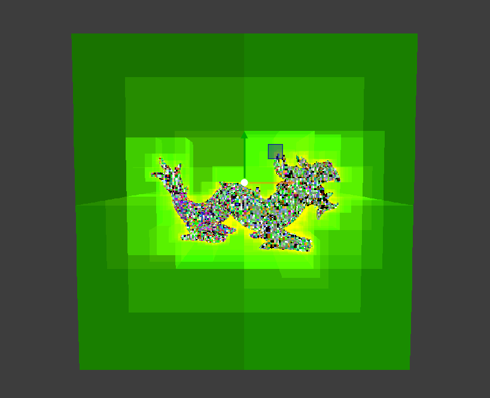
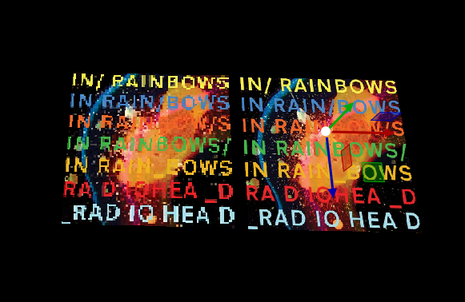

# Pine engine

Pine engine is a solo project of a game engine that uses Java and OpenGL as the backbone
for everything.

## Feature list
- Import of meshes and images
- Gizmos
- Deferred material pipeline
- Voxel baking
- Flexible streaming system
- LOD management

## Sample images
### Voxelization

